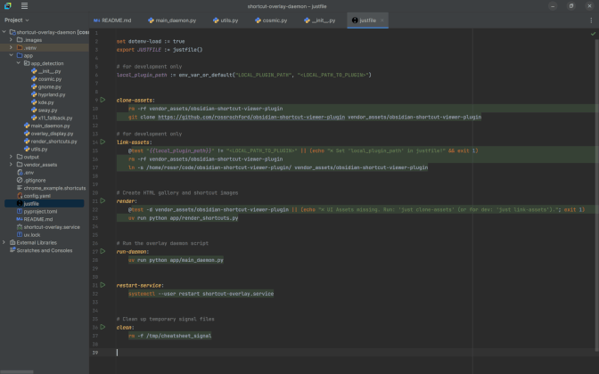

# Shortcut Overlay Daemon

An overlay panel for displaying keyboard shortcuts. It detects the active/top-most application to show relevant shortcuts.




## Prerequisites
- Install `just`: https://github.com/casey/just


### Python GUI Toolkit Headers
Install the `PyGObject` bindings via your system package manager:
- **Arch**: `sudo pacman -S python-gobject cairo pkgconf`
- **Ubuntu/Debian**: `sudo apt install python3-gi python3-gi-cairo gir1.2-gtk-3.0`

### App Detection Tool

Depending on your OS, you will need one of these tools for app detection:

- **Cosmic**: `cosmic-ext-window-helper`
- **Gnome**: [Window Calls Extension](https://github.com/ickyicky/window-calls)
- **Hyprland**: `hyprctl`
- **Sway / i3**: `swaymsg`
- **KDE Plasma**: `qdbus` 
- **Legacy X11**: `xdotool`

* **Note:** This project has only been tested on CachyOS/Cosmic, PRs are welcome.

## Installation & Daemon Setup

### Clone the repos
```bash
git clone github.com/rossrochford/shortcut-overlay-daemon.git
cd shortcut-overlay-daemon/

# wn need additional CSS & JS assets from a second github repo 
just clone-assets
```

### Create a yaml file of shortcuts

See `chrome_example.shortcuts` for an example of the format. It should be valid yaml and have a `.shortcuts` extension.
 
The `app_id` field value is used to map the active app to the shortcuts file. If you don't know an app's id string, just activate the overlay and the error message should display it.

Some special keys (modifiers and arrows) have replacement rules, so for example "right" is rendered as "➡". You can see these rules in: `vendor_assets/obsidian-shortcut-viewer-plugin/src/view.js`

### Point config.yaml to your shortcut files

Edit `shortcut_data_directories` in `config.yaml`, add a path to a directory containing files with extension `.shortcuts`.

```bash
vim config.yaml
```

* **Default Fallback View:** You can define a custom `fallback_app_id` value. 
If no applications are open in a workspace, the daemon will use this app id instead. This is useful for displaying global system-wide shortcuts.


### Generate shortcut images

Your `.shortcuts` yaml files will be rendered into a HTML page `output/gallery.html` and then finally into PNG images. The overlay will simply display these images.

If this is your first time using Playwright on your system, you must initialize the headless Chromium browser binaries first:

```bash
uv run --with playwright python -m playwright install chromium
```

To generate the images, run:
```bash
just render
```

### Confirm the daemon works
```bash
just run-daemon
```

In a separate terminal run:

```bash
echo "TOGGLE" > /tmp/shortcut-overlay-pipe
```

This appends to a FIFO pipe at `/tmp/shortcut-overlay-pipe`. The overlay should show, repeat the command to hide it again. 

### Create a keyboard shortcut to trigger the overlay

Configure a global shortcut inside your Desktop Environment's settings panel so that your preferred key combination runs the shell command and triggers the overlay.

- COSMIC: Settings → Keyboard → Shortcuts → Custom Shortcuts → Add.
- GNOME: Settings → Keyboard → View and Customize Shortcuts → Custom Shortcuts.
- Hyprland: Add this line directly to your `hyprland.conf` file: `bind = $mainMod, backslash, exec, echo "TOGGLE" > /tmp/shortcut-overlay-pipe`

### Create a `systemd` service

To run a background daemon that launches on login, create a `systemd` user service.

Copy the template service file to your systemd config directory, then edit `WorkingDirectory` to point to the root of this repository.

```bash
mkdir -p ~/.config/systemd/user/
cp shortcut-overlay.service ~/.config/systemd/user/

# use a text editor to set 'WorkingDirectory'
vim ~/.config/systemd/user/shortcut-overlay.service  

# Reload systemd and start the service
systemctl --user daemon-reload
systemctl --user start shortcut-overlay.service

# Enable the service so it launches automatically on user log in
systemctl --user enable shortcut-overlay.service

```

> ⚠️ **CRITICAL:** Do **NOT** use `sudo` for these commands. This should run as a `--user` level service.


### Managing the Daemon

* **Check current status:** `systemctl --user status shortcut-overlay.service`
* **Stop the daemon:** `systemctl --user stop shortcut-overlay.service`
* **Restart the daemon:** `systemctl --user restart shortcut-overlay.service`
* **View real-time error/debug logs:** `journalctl --user -u shortcut-overlay.service -f`


### Limitations
- The overlay shows a single image with a fixed width. If your list exceeds the height of your display, the image will show as cropped. There is no support for scrolling or pagination.
- The application does not capture the desktop focus so it cannot itself capture keyboard shortcuts! So for example pressing `Esc` will not close the overlay and the top-most application will respond to that key press.
- Without capturing focus it's also not possible to have a "hold to view" behaviour, where for example showing the overlay while the user holds down a key (hide on release).
